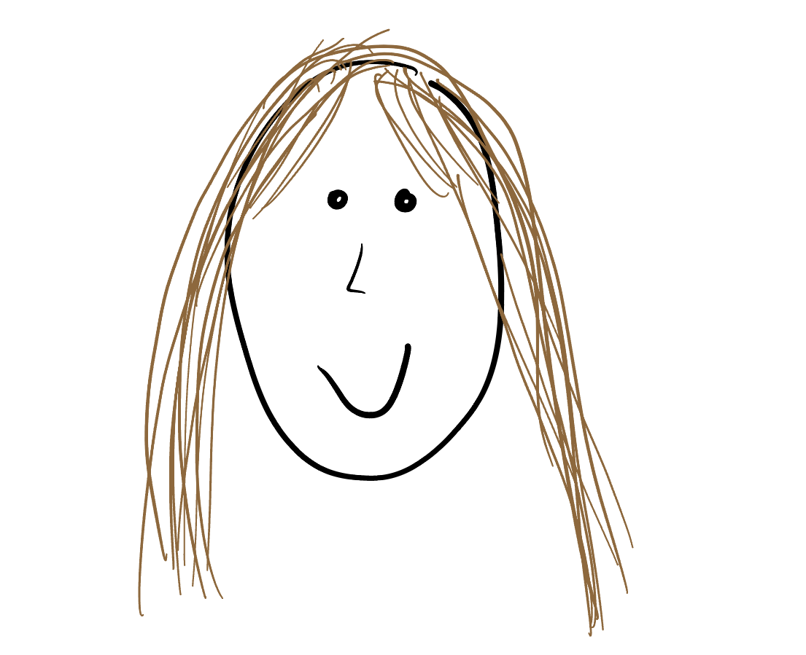
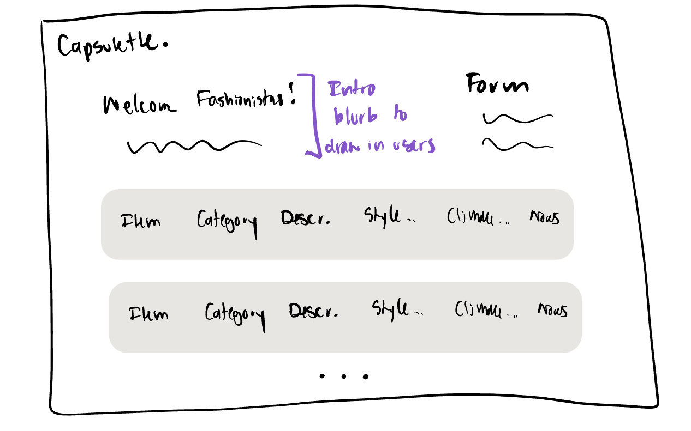
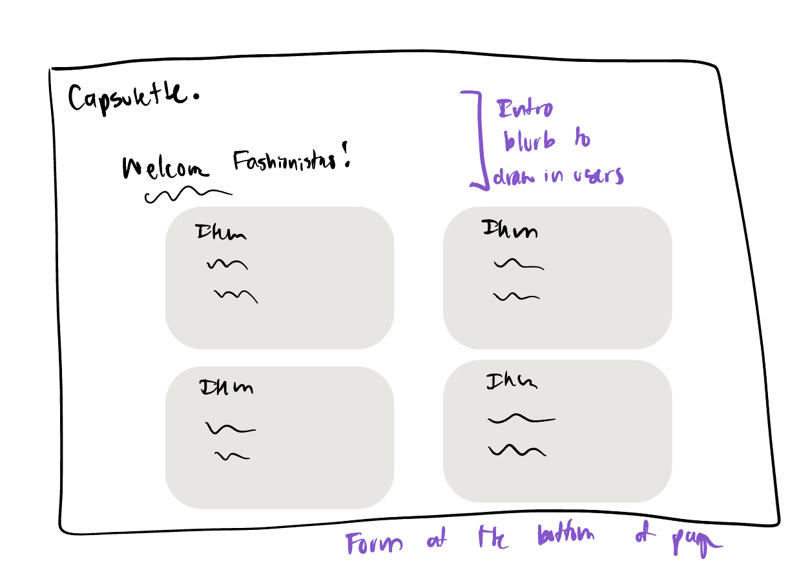

# Project 2: Design Journey

**For each milestone, complete only the sections that are labeled with that milestone.** Refine all sections before the final submission.

You are graded on your design process. If you later need to update your plan, **do not delete the original plan, rather leave it in place and append your new plan _below_ the original.** Then explain why you are changing your plan. Any time you update your plan, you're documenting your design process!

**Replace ALL _TODOs_ with your work.** (There should be no TODOs in the final submission.)

Be clear and concise in your writing. Bullets points are encouraged.

**Everything, including images, must be visible in _Markdown: Open Preview_.** If it's not visible in the Markdown preview, then we can't grade it. We also can't give you partial credit either. **Please make sure your design journey should is easy to read for the grader;** in Markdown preview the question _and_ answer should have a blank line between them.


## Design Plan (Milestone 1)

**Make the case for your decisions using concepts from class, as well as other design principles, theories, examples, and cases from outside of class (includes the design prerequisite for this course).**

You can use bullet points and lists, or full paragraphs, or a combo, whichever is appropriate. The writing should be solid draft quality.


### Catalog (Milestone 1)
> What will your catalog website be about? (1 sentence)

My catalog website will be about the timeliness fashion items that are staples in a young woman's closet.


### Audience (Milestone 1)
> Briefly explain your site's audience. Your audience should be specific, but not arbitrarily specific. (1 sentence)
> Justify why this audience is a **cohesive** group. (1-2 sentences)

My site's audience will be younger women, around 18-25, who are passionate about fashion and are looking to build a wardrobe of staple pieces that will last them a long time. This will be for women who live in a variety of climates, as the pieces will have range in terms of summer vs winter. They are also interested in makeing sustainable choices when it comes to purchasing pieces, preferably from a second-hand clothing site.

This is a cohesive audience because they are of the same demographic (younger women) and have the same interests in fashion and building a sustainable wardrobe.


### Audience Goals (Milestone 1)
> Document your audience's goals for using this catalog website.
> List each goal below. There is no specific number of goals required for this, but you need enough to do the job (Hint: It's more than 1. But probably not more than 3.)
> **Hint:** Users will be able to view all entries in the catalog and insert new entries into the catalog. The audience's goals should probably relate to these activities.

Goal 1: to understand their personal classic style

- **Design Ideas and Choices** _How will you meet those goals in your design?_
  - the catalog will present numerous pieces that the users can view to get inspiration from, along with deatils and how they can be styled
- **Rationale & Additional Notes** _Justify your decisions; additional notes._
  - having this information present in a catalog is organized and allows users to pick and choose which pieces speak to them in order to develop their personal classic style, taking inspiration from their site and their own preferences.

Goal 2: to look for purchase inspiration

- **Design Ideas and Choices** _How will you meet those goals in your design?_
  - presenting the pieces in the catalog with links to where users can purchase these pieces
- **Rationale & Additional Notes** _Justify your decisions; additional notes._
  - by providing links, people can easily find the pieces and purchase them online to build their wardrobe to their desire.

Goal 3: to input their own fashion staples using a form

- **Design Ideas and Choices** _How will you meet those goals in your design?_
  - the form will allow users to submit their own classic pieces
- **Rationale & Additional Notes** _Justify your decisions; additional notes._
  - this allows for user interction and for breadth of opinion, since fashion is subjective and its best to get opinions from everyone who is interested in sharing.


### Audience Device (Milestone 1)
> How will your audience access this website? From a narrow (phone) or wide (laptop) device?
> Justify your decision. (1 sentence)

Laptop

While these audience does use their phones, it is much easier to navigate links and submit the form using a laptop. The catalog will also be viewed optimally using a wide screen.


### Persona (Milestone 1)
> Use the goals you identified above to develop a persona of your site's audience.
> Your persona must have a name and a face. The face can be a photo of a face or a drawing, etc.

Name: Kaitlyn



**Factors that Influence Behavior:**

- Kaitlyn is a junior in college who loves fashion, but finds herself overhwlemed with all ofthe trendy, cheap clothes she has accumulated in the last few years. She is interested in building a capsue wardrobe filled with classic, good quality pieces that will last her unitl her 30s.

**Goals:**

-  Have a wardrobe full of classic pieces
- Learn more about timeliness fashion pieces
- Share her own opinions on pieces that are timeliness and classic
- Be environemntally concious when shopping for clothes


**Obstacles:**

- she likes to view these catalog sites on her laptop as opposed to her mobile
- doesn't have a huge bugdet to spend on new clothes
- is from a colder climate so needs warm clothes

**Desires:**

- She is open to purhcasing new pieces if they fit her style and are well priced
- Get inspired to shop more carefully and selectively
- Specifically, find more classic tops


### Catalog Data (Milestone 1)
> Using your persona, identify the data you need to include in the catalog for your site's audience.
> Justify why this data aligns with your persona's goals. (1 sentence)

Piece name, category, for what weather, how much you need this item, key words for secondhand clothing platform search

- The piece name is to identify what it is
- The category (top, pant, skirt, etc.) can allow the audience to search for pieces within that category, such as Kaitlyn wanting more clasic tops.
- Weather will give information that allows for personalizastion depending on the user's environment. In Kaitlyn's case, she is in colder climate, so she will be looking at pieces labeled with "cold". The options will be: "Cold", "Cooler", "Warmer", "Hot", "Any!".
- Scale of 1 to 5 in how much you need this item will give encouragement for certain paices to be purchased by the audience. In Kaitlyn's case, it will guide her to buy only the pieces she really needs and not all, especially since she has to budget.
- The key words will allow users to find and purchase these items from second-hand clothing sites to encourage sustainable choices easily.


### Site Design (Milestone 1)
> Design your catalog website to address the goals of your persona.
> Sketch your site's design:
>
> - These are **design** sketches, not _planning_ sketches.
> - Use text in the sketches to help us understand your design.
> - Where the content of the text is unimportant, you may use squiggly lines for text.
> - **Do not label HTML elements or annotate CSS classes.** This is not a planning sketch.
>
> Provide a brief explanation _underneath_ each sketch. (1 sentence)
> **Refer to your persona by name in each explanation.**



This design sketch utilizes the "list" method for catalogs, and uses most of the horizontal space for each entry. This is a good design choice considering there are many features that are included for each data point. Additionally, at the top, there is a site description to entice the users from the correct audience and the form.



This design sketch uses a "box" method for items instead of replicating a row in a table. While this is preferred to not ask the user to read across the enture width of the laptop screen, it is a more unusual design that can be difficult to follow if the user is only look at one feature (for example, in Kaitlyn's case, wanting to identify all the entries that are for cold weather). Additionally, the form is at the bottom of the page.

I will pursue the first sketch option.

### Catalog Design Patterns (Milestone 1)
> Explain how you used design patterns for online catalogs in your site's design. (1-2 sentences)

Design 1 uses the familiar design pattern of a "list", which is benefical for users to be able to parse tbrough different parts of the data. Additionally, I opted againts using a table skeleton structure because it makes it seem very unappealing, like a transcript table as opposed to something artsy.


## Implementation Plan (Milestone 1, Milestone 2)

**Provide enough detail in your plan that another 2300 student could implement your plan.**

### Database Schema (Milestone 1)
> Plan the structure of your database. You may use words or a picture.
> A bulleted list is probably the simplest way to do this.
> Make sure you include constraints for each field.

Table: pieces

- id: INTEGER {PK,U,NN,AI}
- piece: TEXT {NN, U}
- category: TEXT {NN}
- weather: TEXT {NN}- this will be a key-value pair to number of dots, as a visual for the users for the weather the piece is most appropriate for
- scale: INTEGER {NN}
- words: TEXT {}


### Database Query Plan (Milestone 1, Final Submission)
> Plan your database queries.
> You may use natural language, pseudocode, or SQL.

1. All Records (Milestone 1)

    ```
    SELECT * FROM pieces;
    ```

2. Insert Record (Final Submission)

    ```
    INSERT INTO pieces (piece, category, weather, need, words)
    VALUES (:piece, :category, :weather, :need, :words);
    ```


### From Validation (Milestone 2)
> Plan the validation criteria for each piece of form data.
>
> Name: must be not empty
> Category: must be not empty (will be drop down menu)
> Weather: must not be empty (will be drop down menu)
> Need scale: must be integer between 1 and 5


### Form Planning (Milestone 2)
> Plan your form validation using **pseudocode**.


1. Initialize default page state (hide/show CSS classes)
2. If form was submitted:
    1. Store form data as variables
    2. Assume form is valid
    3. Validate each piece of required data (note: if field is optional, no validation)
        1. If data is empty:
            1. Mark form as invalid
            2. Show corrective feedback for data
    4. If form data is valid:
        1. Show confirmation
    5. Otherwise:
        1. Set sticky values & echo


### Form Test Data (Milestone 2)
> For each piece of form data, provide samples of valid and invalid data for testing.

**Valid Test Data:**

- piece: valid = "Silk Blouse"
- category: valid = "Tops"
- weather: valid = "Cooler"
- need: valid = 5

**Invalid Test Data:**

- piece: not valid = ""
- category: not valid = No choice
- weather: not valid = No choice
- need: not valid = 8


## Complete & Polished Website (Final Submission)

### Accessibility Audit (Final Submission)
> Tell us what issues you discovered during your accessibility audit.
> What do you do to improve the accessibility of your site?

No accessibility errors!


### Self-Reflection (Final Submission)
> Reflect on what you learned during this assignment. How have you improved from Project 1? What would you do differently next time? (2-3 sentences)

I have improved my form design and implementation from Project 1. In project one, I was just learning about how to design a usable form that actually fits the users' needs, especially my persona's, and how the logistics of the confirmation message works. Now, I am very comfortable with how to create a form, design it with the correct question options and formatting for a better front-end and back-end experience, and show a confirmation message. Next time, I would create more questions for my form and try to incorporate different types of inputs.

> Take some time here to reflect on how much you've learned since you started this class. It's often easy to ignore our own progress. Take a moment and think about your accomplishments in this class. Hopefully you'll recognize that you've accomplished a lot and that you should be very proud of those accomplishments! (1-3 sentences)

Through this project and at this point in the class, I have learned to bekdn together multiple types of coding languages and software applications to create an experience for people through a website. I have learned how these language communicate with each other, where their strengths and weaknesses lie, and how to use them to create the product I am aiming for.


### Collaborators (Final Submission)
> List any persons you collaborated with on this project.

None

### Reference Resources (Final Submission)
> Please cite any external resources you referenced in the creation of your project.
> (i.e. W3Schools, StackOverflow, Mozilla, etc.)

None
